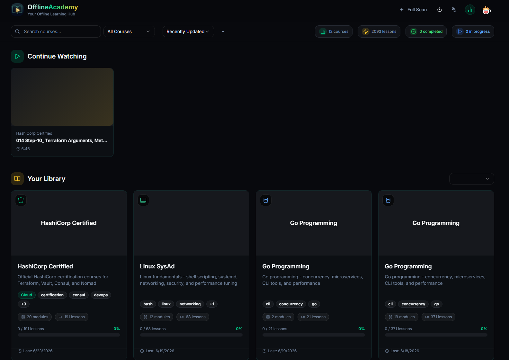
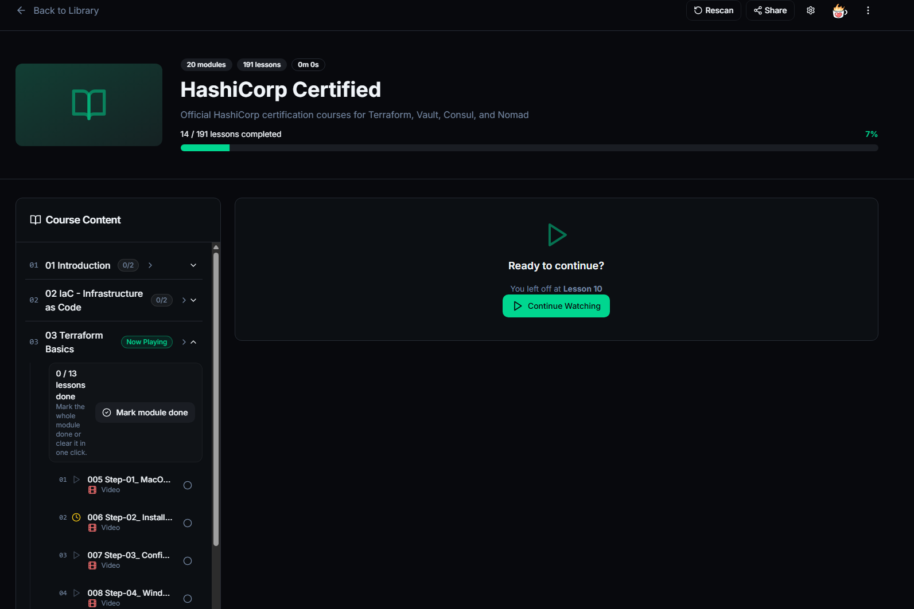
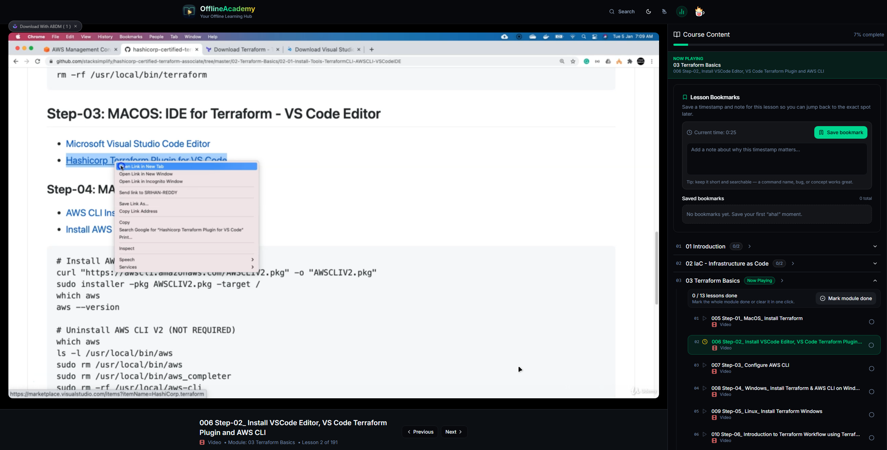
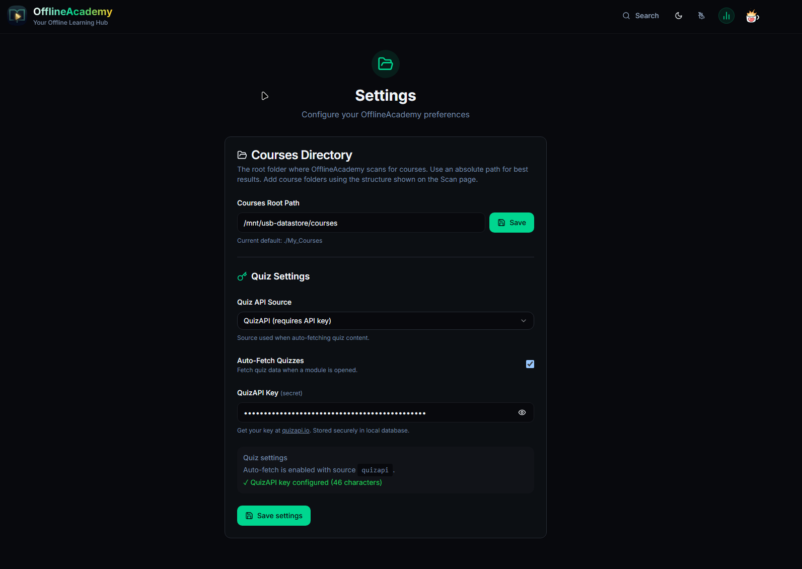

<p align="center">
  
</p>

# OfflineAcademy

<p align="center">
  <strong>A self-hosted, LAN-first video course library for private learning.</strong>
</p>

<p align="center">
  Turn a local folder of course videos into a clean learning dashboard with progress tracking, bookmarks, tags, categories, and optional AI-generated quizzes.
</p>

<p align="center">
  
  
  
  
  
</p>

---

## Table of Contents

- [Why OfflineAcademy?](#why-offlineacademy)
- [Feature Highlights](#feature-highlights)
- [Screenshots](#screenshots)
- [Tech Stack](#tech-stack)
- [Quick Start: Docker Hub](#quick-start-docker-hub)
- [Other Deployment Options](#other-deployment-options)
- [Configuration](#configuration)
- [Course Folder Structure](#course-folder-structure)
- [Data & Persistence](#data--persistence)
- [Updating](#updating)
- [Backup](#backup)
- [Security Notes](#security-notes)
- [Support the Project](#support-the-project)
- [License](#license)

---

## Why OfflineAcademy?

Most online course platforms assume cloud storage, user accounts, subscriptions, and constant internet access. OfflineAcademy is built for a different workflow:

- You already have course videos stored locally.
- You want a clean interface to browse, watch, and resume lessons.
- You want progress tracking without uploading your learning data anywhere.
- You want a private LAN app that works from your desktop, laptop, tablet, or phone.
- You want optional quiz practice without turning the app into a cloud product.

OfflineAcademy is designed for **single-user local/LAN deployments**: home servers, NAS boxes, mini PCs, Docker hosts, homelabs, and personal workstations.

---

## Feature Highlights

### Course Library

- Scan a local course directory and build a browsable library.
- Display course cards with progress, metadata, tags, categories, and quick actions.
- Pin/favorite important courses.
- Rename courses from the UI.
- **Delete from library** to hide/archive without deleting files.
- **Delete from disk** when you intentionally want to remove course files.
- Unified action menus across dashboard and course pages.

### Video Learning Experience

- Browser-based playback for local video files.
- Resume playback from the last watched position.
- Track lesson progress automatically.
- Continue watching card for the most recent lesson.
- Mobile-friendly controls and responsive layout.
- Playback speed controls.
- Fullscreen and picture-in-picture support where supported by the browser.
- Keyboard shortcuts overlay.

### Bookmarks & Learning Notes

- Bookmark lessons for later review.
- Store bookmark notes alongside lessons.
- Revisit saved moments without hunting through folders manually.

### Course Organization

- Add custom tags to courses.
- Add categories to courses.
- Filter and search the course library.
- Keep all organization metadata local to the app/database.

### AI Quiz Practice

- Generate module-level practice quizzes.
- Supports QuizAPI and The Trivia API.
- Per-video quiz topic overrides.
- Clear or regenerate quizzes from course actions.
- Smart skip logic for low-value quiz targets:
  - introductions
  - footnotes
  - appendices
  - bonus lectures
  - modules without useful quiz topics
- Graceful fallback handling when providers rate-limit or lack matching categories.

### Offline & Local-First Design

- No accounts.
- No user profiles.
- No required cloud storage.
- Local SQLite database via Prisma.
- Offline-capable PWA behavior through service worker caching.
- Machine-scoped settings from the app UI.

### Deployment-Friendly

- Docker Hub image for the fastest install.
- Docker Compose support for repeatable local/LAN deployment.
- Local Node.js deployment for development or customization.
- Portable folder mounts for courses and database.
- Suitable for trusted LAN/homelab environments.

---

## Screenshots

### Dashboard

Browse courses, continue the most recent lesson, filter your library, and see learning stats at a glance.



### Course Page

View course progress, modules, lessons, and quick actions from a focused course detail page.



### Watch Page

Watch lessons with progress tracking, course navigation, and bookmark notes in one place.



### Settings

Configure the course directory, quiz provider, auto-fetch behavior, and API key from the local settings page.



---

## Tech Stack

```text
Frontend      Next.js 14, React 18, TypeScript
Styling       Tailwind CSS, Radix UI
Database      SQLite
ORM           Prisma
Runtime       Node.js
Deploy        Docker Hub / Docker Compose recommended; local Node.js supported
```

---

## Quick Start: Docker Hub

Docker is the recommended way to run OfflineAcademy.

It avoids local Node.js setup, uses the published image, and keeps your courses/database mounted outside the container.

### Prerequisites

- Docker
- Docker Compose
- A folder containing your course videos

### 1. Create an app folder

```bash
mkdir -p offlineacademy/My_Courses offlineacademy/prisma
cd offlineacademy
```

### 2. Download the Docker Compose file and environment template

```bash
curl -fsSL -o docker-compose.yml https://raw.githubusercontent.com/nicetry247/offlineacademy/main/docker-compose.hub.yml
curl -fsSL -o .env https://raw.githubusercontent.com/nicetry247/offlineacademy/main/.env.example
```

### 3. Create the SQLite database file and set bind-mount permissions

```bash
touch prisma/dev.db
chmod -R a+rX My_Courses
chmod 664 prisma/dev.db
```

Docker bind mounts keep the host filesystem permissions. Creating `My_Courses` and `prisma/dev.db` before `docker compose up` prevents Docker from creating them as `root`, and the `chmod` commands make the course folder readable by the container.

### 4. Start OfflineAcademy

```bash
docker compose pull
docker compose up -d
```

Open:

```text
http://localhost:6767
```

For another device on your LAN, replace `localhost` with your server IP:

```text
http://YOUR_SERVER_IP:6767
```

### Docker Hub Image

OfflineAcademy is published on Docker Hub:

```text
https://hub.docker.com/r/nicetry247/offlineacademy
```

Available tags:

```text
nicetry247/offlineacademy:latest
nicetry247/offlineacademy:1.0.0
```

Direct pull:

```bash
docker pull nicetry247/offlineacademy:latest
```

---

## Other Deployment Options

### Build locally from source with Docker

Use this if you want to modify the app and build your own image locally.

```bash
git clone https://github.com/nicetry247/offlineacademy.git
cd offlineacademy
cp .env.example .env
mkdir -p My_Courses prisma
touch prisma/dev.db
docker compose up --build -d
```

### Local Node.js development

Use this for development, debugging, or source-level customization.

#### Prerequisites

- Node.js 18+ recommended
- npm
- A folder containing your course videos

#### 1. Clone the repository

```bash
git clone https://github.com/nicetry247/offlineacademy.git
cd offlineacademy
```

#### 2. Create your environment file

```bash
cp .env.example .env
```

Edit `.env` if needed:

```env
DATABASE_URL="file:./dev.db"
COURSES_ROOT="./My_Courses"
NEXT_PUBLIC_APP_URL="http://localhost:6767"
QUIZAPI_KEY=""
```

#### 3. Install dependencies

```bash
npm ci
```

#### 4. Prepare the database

```bash
npx prisma generate
npx prisma db push
```

#### 5. Add courses

```bash
mkdir -p My_Courses
```

Place your course folders inside `My_Courses`.

#### 6. Build and run

```bash
npm run build
npx next start -p 6767
```

### Custom Course Folder

You can store courses anywhere on the host. Update your Compose file and map your folder to `/app/My_Courses` inside the container:

```yaml
volumes:
  - /path/to/your/courses:/app/My_Courses
  - ./prisma/dev.db:/app/prisma/dev.db
```

Examples:

```yaml
# Linux
- /mnt/media/courses:/app/My_Courses

# macOS
- /Users/you/Videos/Courses:/app/My_Courses

# Windows with Docker Desktop
- C:/Users/you/Videos/Courses:/app/My_Courses
```

#### Docker bind-mount permissions

On Linux, Docker bind mounts use the host folder's existing permissions. If the folder does not exist before `docker compose up`, Docker may create it as `root`, which can make course scanning fail or force manual `chown` later.

Recommended setup:

```bash
mkdir -p My_Courses prisma
touch prisma/dev.db
chmod -R a+rX My_Courses
chmod 664 prisma/dev.db
```

If your course files were copied as `root` or live on a restrictive mounted disk, make them readable by the container:

```bash
chmod -R a+rX /path/to/your/courses
```

If you enable features that write quiz cache files into course folders, the container also needs write access to the mounted course directory. One option is:

```bash
sudo chown -R 1001:1001 /path/to/your/courses
```

For scan-only use, read access is usually enough.

### Publishing to Docker Hub

Maintainers can publish manually:

```bash
docker login
docker build --no-cache -t nicetry247/offlineacademy:latest .
docker tag nicetry247/offlineacademy:latest nicetry247/offlineacademy:1.0.0
docker push nicetry247/offlineacademy:latest
docker push nicetry247/offlineacademy:1.0.0
```

You can also automate Docker Hub publishing later with GitHub Actions. To do that, add repository secrets for:

```text
DOCKERHUB_USERNAME
DOCKERHUB_TOKEN
```

Then add a workflow that builds and pushes `nicetry247/offlineacademy:latest` on pushes to `main` and version tags like `v1.0.0`.

---

## Configuration

| Variable | Required | Purpose | Example |
|---|---:|---|---|
| `DATABASE_URL` | Yes | SQLite database path | `file:./dev.db` |
| `COURSES_ROOT` | Yes | Course folder path inside the app/container | `./My_Courses` |
| `NEXT_PUBLIC_APP_URL` | Recommended | Public app URL used by metadata and links | `http://localhost:6767` |
| `QUIZAPI_KEY` | Optional | QuizAPI key for quiz generation | `qa_...` |

Settings can also be managed inside the app at:

```text
/settings
```

---

## Course Folder Structure

OfflineAcademy works best when courses are organized as folders containing module folders and video files.

```text
My_Courses/
└── Example Course/
    ├── 01 - Introduction/
    │   └── 01 - Welcome.mp4
    ├── 02 - Core Concepts/
    │   ├── 01 - Lesson One.mp4
    │   └── 02 - Lesson Two.mp4
    └── 03 - Practice/
        └── 01 - Lab Walkthrough.mp4
```

Supported video extensions include common browser-playable formats such as `.mp4`, plus additional local media formats depending on browser support.

---

## Data & Persistence

OfflineAcademy stores app data locally.

```text
SQLite database    prisma/dev.db
Course files       My_Courses/ or your configured course mount
Environment        .env
Quiz cache         Course/module folders where generated
```

Important user data:

- watch progress
- bookmarks
- bookmark notes
- course metadata
- tags and categories
- quiz records/cache
- local app settings

---

## Updating

### Local Node.js

```bash
git pull
npm ci
npx prisma generate
npx prisma db push
npm run build
npx next start -p 6767
```

### Docker

```bash
git pull
docker compose up --build -d
```

---

## Backup

Back up these items regularly:

```text
prisma/dev.db       Main SQLite database
.env                Local configuration and optional API key
My_Courses/         Your source course library, if not backed up elsewhere
```

A simple backup can be as easy as copying `prisma/dev.db` somewhere safe before updates.

---

## Security Notes

OfflineAcademy is designed for trusted local networks and personal/homelab use.

Before exposing it to the public internet, add:

- HTTPS
- reverse proxy authentication
- network access controls
- regular database backups
- careful handling of `.env` and API keys

Do not commit `.env`, local databases, course files, or private API keys.

---

## Support the Project

<p align="center">
  <a href="https://ko-fi.com/nicetry247">
    
  </a>
</p>

<p align="center">
  <strong>If OfflineAcademy saves you time, feeds your homelab brain, or keeps your course chaos under control, consider fueling the next round.</strong><br />
  <a href="https://ko-fi.com/nicetry247"><strong>Support OfflineAcademy on Ko-fi →</strong></a>
</p>

---

## License

OfflineAcademy is released under the **MIT License**.

You are free to use, copy, modify, merge, publish, distribute, sublicense, and/or sell copies of the software, subject to the terms of the MIT License.

See [`LICENSE`](LICENSE) for the full license text.
